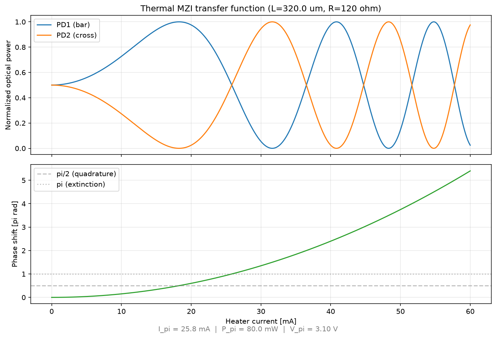

# Cornerstone Si220 Sample Project

Sample designs for the **Cornerstone 220 nm silicon** platform, built with
[GDSFactory+](https://gdsfactory.com) and the open-source Cornerstone PDK
(`cspdk.si220`). The PDK covers both C-band and O-band: pick the band with the
cross-section (`strip_cband`, `rib_cband`, `strip_oband`, `rib_oband`).

⚠ **Notice:** This project requires an active **GDSFactory+** subscription.
To learn more, visit **[GDSFactory.com](https://GDSFactory.com)**.

## What's inside

- **Schematics** (`mycspdk/*.pic.yml`, `*.scm.yml`): MZIs, ring filters, lattice
  filters, routing bundles, pads and die frames.
- **Python cells** (`mycspdk/*.py`, `mycspdk/samples/`): routed MZIs, splitter
  trees, an OPA-style MZI tree and a Clements mesh with heater-to-pad routing.
- **A\* routing** (`astar*.pic.yml`, `lattice.pic.yml`): bundles routed with the
  `route_astar` and `route_astar_metal` strategies, including around obstacles.
  These come from [doroutes](https://pypi.org/project/doroutes/), which this
  project installs.
- **Active circuits** (`mycspdk/samples/heater_*.py`, `thermal_mzi_sweep.py`,
  `mycspdk/circuits/thermal_mzi.nyancir`): thermal phase shifters simulated with
  [circulax](https://github.com/gdsfactory/circulax):
  - heater I-V curve and power needed for a π phase shift;
  - heater resistance against length;
  - an MZI driven by a DC heater-current sweep.
- **Circuit optimisation** (`notebooks/4_circuit_optimization.ipynb`): fit an MZI's
  delay length to a target wavelength with SAX and JAX.



## Getting started

```bash
uv sync --all-extras
uv run gfp test   # build every cell in the project
```
